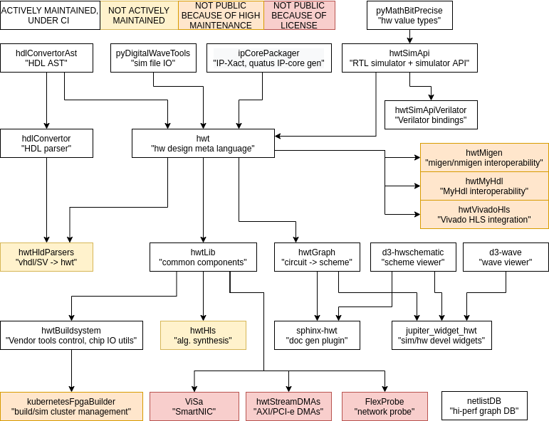

# HWToolkit (hwt),
# the library for hardware development in Python
[](https://circleci.com/gh/Nic30/hwt)
[](https://coveralls.io/github/Nic30/hwt?branch=master)
[](http://badge.fury.io/py/hwt)
[](http://hwtoolkit.readthedocs.io/en/latest/?badge=latest)
[](https://github.com/Nic30/hwt)
[](https://img.shields.io/pypi/pyversions/hwt.svg)
[](https://gitter.im/hwt-community/community?utm_source=badge&utm_medium=badge&utm_campaign=pr-badge&utm_content=badge)

## Keywords

* Metaprogramming (Hardware Construction Language HCL, templatization) + HLS.
* Simulator API, UVM
* Buildtool, IP core generator

## How HWT can help you?

* The lower layer (IR, HDL serializers) is a shield against a problems related to VHDL/Verilog. It is checking for correctness and synthetisability and removing specific of HDLs.
* The system level and HLS layer allows you to quickly build desing generators with advance optimisation techniques of your choice.
* Simulator API and it's UVM simulation environment is just python object with C++ binding. This makes it easy to use while not sacrificing performance.
* Rich type system can describe also data locality and packet features. This significantly simplifies configuration of component which are working with packets or any data over remote bus.
* HWT is not compiler nor transpiler but it is actually a core library. It contains only necessary stuff and you can can modify/extend any part any time.
  Because the word of HW developement is always full of unexpected situations.


## Features

* Hardware Construction Language (HCL) (example [simple](https://github.com/Nic30/hwtLib/blob/master/hwtLib/examples/simple.py), [showcase](https://github.com/Nic30/hwtLib/blob/master/hwtLib/examples/showcase0.py)). It is somewhere between HLS and HDL. It offers HLS style of coding but at the same time it allows you to manipulate HDL objects. This means it is a little bit slower to write a prototype than you would in HLS, but you always know what, how and why is happening.
* Digital circuit simulator with UVM like verification environment (example usage [CAM](https://github.com/Nic30/hwtLib/blob/master/hwtLib/mem/cam_test.py), [structWriter_test.py](https://github.com/Nic30/hwtLib/blob/master/hwtLib/structManipulators/structWriter_test.py))
* Tools for static analysis ([resourceAnalyzer](https://github.com/Nic30/hwt/blob/master/hwt/serializer/resourceAnalyzer/analyzer.py), example usage [cntr_test.py](https://github.com/Nic30/hwtLib/blob/master/hwtLib/examples/arithmetic/cntr_test.py))
* Serializers to export HWT designs into multiple target HDLs ([verilog, VHDL, system-c, IP-core packager, hwt itself...](https://github.com/Nic30/hwt/tree/master/hwt/serializer))

HWT uses hilevel-netlists for internal representation of target design. Optimized netlists are generated from usual code statements, function calls, statements etc (hw processes are automatically resolved). This netlist is easy to use and easy to modify or analyse by user if there is something missing in main library.
Also [serialization modes](https://github.com/Nic30/hwt/blob/master/hwt/serializer/mode.py) allows to tweaks how component should behave during serialization.

HWT performs no HLS planing or schedueling. HWT is also good as API for code generating by more advanced tools. Hierarchy of components/interfaces/types is not limited. User specifed names are checked for collision with target language.

HWT designs are objects. No specific compiler execution is required, just run `python3`, import the thing and use `to_rtl` metod or other (take a look at [examples](https://github.com/Nic30/hwtLib/blob/master/hwtLib/)).


## HWT ecosystem




## Installation

This library is a regular python package. You can install it using:
```
# system-wide, use -u for local use only
sudo pip3 install hwt

# or directly from git
pip3 install --upgrade --force-reinstall --no-cache-dir -r https://raw.githubusercontent.com/Nic30/hwt/master/doc/requirements.txt git+https://github.com/Nic30/hwt.git@master#egg=hwt
```

Then you are able to use functions and classes defined in the hwt library from a python console or script.
Installation of [hwtLib](https://github.com/Nic30/hwtLib) is recomended as it contains common interfaces, agents, components etc...

## FAQ

* Where is the entry point of the compiler?
  * This is not a compiler, it is library of the objects which can be converted to Verilog/VHDL and back.
* How do I get Verilog/VHDL?
  * Use `to_rtl` method [example](https://github.com/Nic30/hwtLib/blob/master/hwtLib/examples/simple.py)
* How do I define my interface type, protocol and simulation agent?
  * Derive from any Interface class. [example](https://github.com/Nic30/hwt/blob/master/hwt/interfaces/std.py#L107)
* I do have c structure of UDP header, how do I send/receive UDP packet over AXI-stream interface?
  * Define HStruct type composed of eth_header_t, IPv4_header_t and HStream(uint8_t) and use [AxisFrameGen](https://github.com/Nic30/hwtLib/blob/master/hwtLib/amba/axis_comp/frameGen.py). There is and example of [ping responder](https://github.com/Nic30/hwtLib/blob/master/hwtLib/examples/builders/pingResponder.py)


## Similar projects

* [autofpga](https://github.com/ZipCPU/autofpga) - C++, A utility for Composing FPGA designs from Peripherals
* :skull: [baremetal](https://github.com/dawsonjon/baremetal) - Python, simple HCL
* [BinPy](https://github.com/BinPy/BinPy) - Python, An electronic simulation library
* :skull: [pervognsen/Bitwise](https://github.com/pervognsen/bitwise) - Python, HDL which translates python directly
* :skull: [jamesjiang52/Bitwise](https://github.com/jamesjiang52/Bitwise) - Python, simple HCL.
* [blarney](https://github.com/blarney-lang/blarney) - Haskell, HCL
* [bsc](https://github.com/B-Lang-org/bsc) - Haskell, C++, BSV - Bluespec Compiler
* [Cement HDL/CmtHDL](https://github.com/pku-liang/Cement) - Rust, eHDL
* [chisel](https://chisel.eecs.berkeley.edu/) - 2012-?, Scala, HCL
* [Chips-2.0](https://github.com/dawsonjon/Chips-2.0) - , , FPGA Design Suite based on C to Verilog design flow
* [circt](https://github.com/llvm/circt) - 2020-?, C++/LLVM, compiler infrastructure
* [circuitgraph](https://github.com/circuitgraph/circuitgraph) - Tools for working with circuits as graphs in python
* [concat](https://github.com/conal/concat) - 2016-?, Haskell, Haskell to hardware
* [DUH](https://github.com/sifive/duh) - JS, simple convertor between verilog/scala/ipxact
* [DFiant](https://github.com/DFiantHDL/DFiant) 2019-?, Scala, dataflow based HDL
* [edalize](https://github.com/olofk/edalize) - 2018-?, Python, abstraction layer for eda tools
* [garnet](https://github.com/StanfordAHA/garnet) -2018-?, Python, Coarse-Grained Reconfigurable Architecture generator based on magma
* [hammer](https://github.com/ucb-bar/hammer) - 2017-?, Python, Highly Agile Masks Made Effortlessly from RTL
* [heterocl](https://github.com/cornell-zhang/heterocl) - 2017-?, C++, A Multi-Paradigm Programming Infrastructure for Software-Defined Reconfigurable Computing
* [hoodlum](https://github.com/tcr/hoodlum) - 2016-?, Rust, HCL
* [ILAng](https://github.com/Bo-Yuan-Huang/ILAng) - modeling and verification platform for SoCs where Instruction-Level Abstraction (ILA) is used as the formal model for hardware components.
* :skull: [jhdl](https://github.com/larsjoost/jhdl) - ?-2017, C++ Verilog/VHDL -> systemC, prototype
* [Kactus2](http://funbase.cs.tut.fi) - IP-core packager
* [kratos](https://github.com/Kuree/kratos) - C++/Python, hardware generator/simulator
* [lgraph](https://github.com/masc-ucsc/lgraph) - C, generic graph library
* [llhd](https://github.com/fabianschuiki/llhd) - Rust, HCL
* [livehd](https://github.com/masc-ucsc/livehd) - mainly C++, An infrastructure designed for Live Hardware Development.
* [Lucid HDL in Alchitry-Labs](https://github.com/alchitry/Alchitry-Labs) - Custom language and IDE inspired by Verilog
* [magma](https://github.com/phanrahan/magma/) - 2017-?, Python, HCL
* [amaranth](https://github.com/amaranth-lang/amaranth)/[migen](https://github.com/m-labs/migen) - 2013-?, Python, HCL
* [mockturtle](https://github.com/lsils/mockturtle) - logic network library
* [moore](https://github.com/fabianschuiki/moore) - Rust, HDL -> model compiler
* [msdsl](https://github.com/sgherbst/msdsl) - Python, real number model -> verilog
* [MyHDL](https://github.com/myhdl/myhdl) - 2004-?, Python, Process based HDL
* [Amaranth HDL](https://github.com/amaranth-lang/amaranth) -, Python, (previously nMigen) A refreshed Python toolbox for building complex digital hardware
* [OpenTimer](https://github.com/OpenTimer/OpenTimer) - , C++,  A High-Performance Timing Analysis Tool for VLSI Systems
* [percy](https://github.com/whaaswijk/percy) - Collection of different synthesizers and exact synthesis methods for use in applications such as circuit resynthesis and design exploration.
* [PyChip-py-hcl](https://github.com/scutdig/PyChip-py-hcl) - , Python, Chisel3 like HCL
* [pygears](https://github.com/bogdanvuk/pygears) - , Python, function style HDL generator
* [PyMTL3](https://github.com/cornell-brg/pymtl3) 2018-?
* [PyMTL](https://github.com/cornell-brg/pymtl) - 2014-?, Python, Process based HDL
* [PipelineC](https://github.com/JulianKemmerer/PipelineC) - 2018-?, Python, C++ HLS-like automatic pipelining as a language construct/compiler
* [PyRTL](https://github.com/UCSBarchlab/PyRTL) - 2015-?, Python, HCL
* [Pyverilog](https://github.com/PyHDI/Pyverilog) - 2013-? Python-based Hardware Design Processing Toolkit for Verilog HDL
* [rogue](https://github.com/slaclab/rogue) , C++/Python - Hardware Abstraction & Data Acquisition System
* [rohd](https://github.com/intel/rohd), 2023-?, dart, HCL
* [sail](https://github.com/rems-project/sail) 2018-?, (OCaml, Standard ML, Isabelle) - architecture definition language
* :skull: [SFGen](https://github.com/dillonhuff/SFGen) - Python, arithmetic function generator
* [spatial](https://github.com/stanford-ppl/spatial) - Scala, an Argon DSL like, high level abstraction
* [SpinalHDL](https://github.com/SpinalHDL/SpinalHDL) - 2015-?, Scala, HCL
* [Silice](https://github.com/sylefeb/Silice) - ?, C++, Custom HDL
* :skull: [SyDpy](https://github.com/bogdanvuk/sydpy) - ?-2016, Python, HCL and verif. framework operating on TML/RTL level
* [systemrdl-compiler](https://github.com/SystemRDL/systemrdl-compiler) - Python,c++, register description language compiler
* [UHDM](https://github.com/alainmarcel/UHDM) - C++ SystemVerilog -> C++ model
* :skull: [Verilog.jl](https://github.com/interplanetary-robot/Verilog.jl) - 2017-2017, Julia, simple Julia to Verilog transpiler
* [veriloggen](https://github.com/PyHDI/veriloggen) - 2015-?, Python, Verilog centric HCL with HLS like features
* :skull:  [wyre](https://github.com/nickmqb/wyre) - 2020-2020, Mupad, Minimalistic HDL
* [phi](https://github.com/donn/Phi) - 2019-?, custom language, llvm based compiler of custom hdl
* [prga](https://github.com/PrincetonUniversity/prga) - 2019-?. Python, prototyping platform with integrated yosys
* [Hardcaml](https://github.com/janestreet/hardcaml) - OCaml, HCL
* [magia-hdl](https://github.com/magia-hdl/magia) - 2023-?, Python, HCL
* [Metron](https://github.com/aappleby/Metron) - C++, C++ -> SystemVerilog syntax translator

### Dictionary
* IR - Internal Representation
* HDL - Hardware Design Languge (Lang. construct maps directly to specific HW part)
* eHDL - Embedded HDL (HDL construct avare source code generator)
* HCL - Hardware Construction Language (User code constructs IR. IR can be directly transipled to HDL)
* HLS - High Level Synthesis (User code is translated to IR. IR is compiled
 to HDL IR in multiple complex steps, typically contains scheduling, arch. mapping etc.)

## Related open-source

* [fusesoc](https://github.com/olofk/fusesoc) - package manager and a set of build tools for FPGA/ASIC development
* [OpenSTA](https://github.com/abk-openroad/OpenSTA) - a gate level static timing verifier
* [RePlAce](https://github.com/abk-openroad/RePlAce) - global placement tool
* [verilator](https://www.veripool.org/wiki/verilator) - Verilog -> C/C++ simulator
* [vtr-verilog-to-routing](https://github.com/verilog-to-routing/vtr-verilog-to-routing)
* [yosys](https://github.com/YosysHQ/yosys) - RTL synthesis framework
* [UHDM](https://github.com/alainmarcel/UHDM) - SV -> C++


## Board support libraries (Potential candidates for public integration)

* [litex](https://github.com/enjoy-digital/litex) - Buildsystem for migen
* [loam](https://github.com/phanrahan/loam) - Buildsystem for magma
* [vivado-boards](https://github.com/Digilent/vivado-boards) - Vivado XML/TCL files with board description
* [nmigen-boards](https://github.com/nmigen/nmigen-boards) - board and connector meta fo nmigen


## Sources of informations in this area

* [computer-engineering-resources](https://github.com/rajesh-s/computer-engineering-resources) - list of conferences and hardware projects
